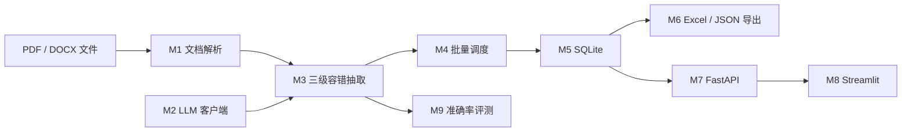

# PaperExtractor 架构

> 当前已完成 M0～M8，M9 评测代码也已实现；6 篇种子开发集已确认，正式验收仍需完成 30 篇独立盲测标注并运行两轮真实预测。

## 核心契约

项目统一抽取 11 个字段：标题、作者、年份、发表平台、文档类型、研究问题、
方法名称、实验条件、主要结果、局限性和摘要总结。M1 已在
`app/models.py` 中用一份 Pydantic Schema 定义，后续由 LLM 校验、FastAPI
响应模型和评测脚本共同复用。
