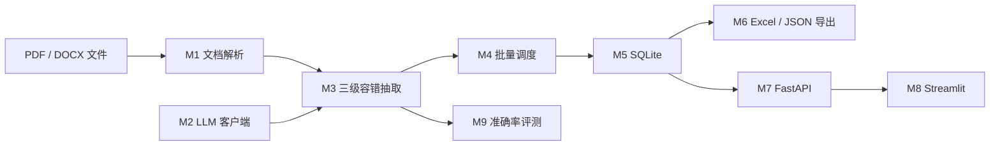

# PaperExtractor 架构

> 当前已完成 M0～M9。最终 `final-holdout-v1` 的 30 篇独立留出集已冻结人工标签并完成真实运行；后续仅允许复现测量或在新数据集上验证，不再用该集调 Prompt 或抽取规则。

## 核心契约

项目统一抽取 11 个字段：标题、作者、年份、发表平台、文档类型、研究问题、
方法名称、实验条件、主要结果、局限性和摘要总结。M1 已在
`app/models.py` 中用一份 Pydantic Schema 定义，后续由 LLM 校验、FastAPI
响应模型和评测脚本共同复用。
