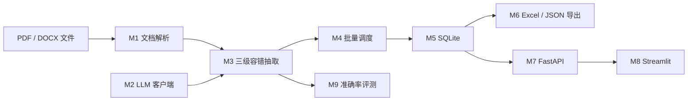

# PaperExtractor 架构

> 当前完成 M0 环境与骨架、M1 文档解析、M2 LLM 客户端与 Prompt。下图表示后续 M3～M9 将逐步实现的目标架构，
> 不是一次性完成的现状声明。

## 核心契约

项目统一抽取 11 个字段：标题、作者、年份、发表平台、文档类型、研究问题、
方法名称、数据集、主要结果、局限性和摘要总结。M1 已在
`app/models.py` 中用一份 Pydantic Schema 定义，后续由 LLM 校验、FastAPI
响应模型和评测脚本共同复用。
