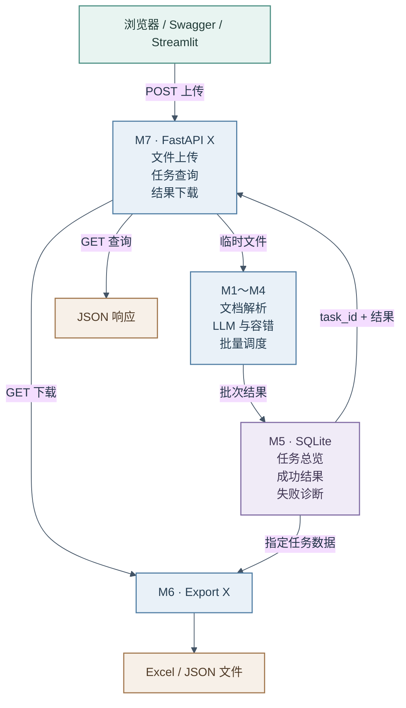

# PaperExtractor M7 API Flow

FastAPI 作为现有 M1～M6 后端流程的 HTTP 入口。

```mermaid
%%{init: {"theme":"base","flowchart":{"curve":"basis","htmlLabels":true,"nodeSpacing":45,"rankSpacing":55},"themeVariables":{"background":"#ffffff","primaryTextColor":"#243447","lineColor":"#435466","fontFamily":"Microsoft YaHei, Arial, sans-serif"}}}%%
flowchart TB
    client["浏览器 / Swagger / Streamlit"]
    api["M7 · FastAPI X<br/>文件上传<br/>任务查询<br/>结果下载"]
    pipeline["M1～M4<br/>文档解析<br/>LLM 与容错<br/>批量调度"]
    database["M5 · SQLite　<br/>任务总览<br/>成功结果<br/>失败诊断"]
    exporter["M6 · Export X"]
    response["JSON 响应"]
    files["Excel / JSON 文件"]

    client -->|"POST 上传"| api
    api -->|"临时文件"| pipeline
    pipeline -->|"批次结果"| database
    database -->|"task_id + 结果"| api
    api -->|"GET 查询"| response
    api -->|"GET 下载"| exporter
    database -->|"指定任务数据"| exporter
    exporter --> files

    classDef input fill:#e8f4f1,stroke:#4b8f83,color:#203b37,stroke-width:1.5px;
    classDef service fill:#e9f1f8,stroke:#527fa5,color:#263e52,stroke-width:1.5px;
    classDef storage fill:#f0ebf7,stroke:#816ca4,color:#413754,stroke-width:1.5px;
    classDef output fill:#f7f0e8,stroke:#a2784f,color:#503b27,stroke-width:1.5px;
    class client input;
    class api,pipeline,exporter service;
    class database storage;
    class response,files output;
```
