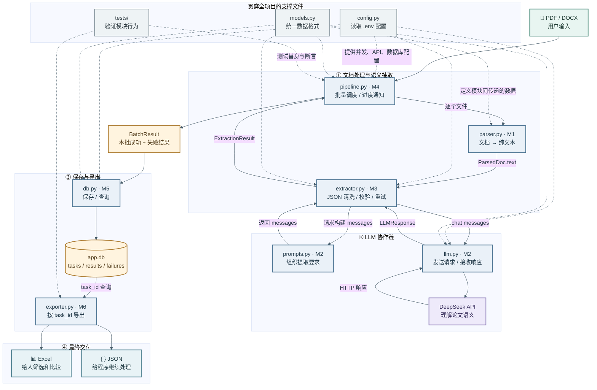

# PaperExtractor 项目文件关系图

实线表示运行时的数据流，虚线表示配置、模型或测试对模块的支撑关系。

```mermaid
%%{init: {"theme":"base","themeVariables":{"background":"#ffffff","fontFamily":"Microsoft YaHei, Arial, sans-serif","lineColor":"#465b69","primaryTextColor":"#21313d"},"flowchart":{"curve":"basis","nodeSpacing":30,"rankSpacing":36}}}%%
flowchart TB
    input["📄 PDF / DOCX<br/>用户输入"]

    subgraph process["① 文档处理与语义抽取"]
        direction LR
        pipeline["pipeline.py · M4<br/>批量调度 / 进度通知"]
        parser["parser.py · M1<br/>文档 → 纯文本"]
        extractor["extractor.py · M3<br/>JSON 清洗 / 校验 / 重试"]
    end

    subgraph ai["② LLM 协作链"]
        direction LR
        prompts["prompts.py · M2<br/>组织提取要求"]
        llm["llm.py · M2<br/>发送请求 / 接收响应"]
        deepseek["DeepSeek API<br/>理解论文语义"]
    end

    batch["BatchResult<br/>本批成功 + 失败结果"]

    subgraph persistence["③ 保存与导出"]
        direction LR
        database["db.py · M5<br/>保存 / 查询"]
        sqlite[("app.db<br/>tasks / results / failures")]
        exporter["exporter.py · M6<br/>按 task_id 导出"]
    end

    subgraph outputs["④ 最终交付"]
        direction LR
        excel["📊 Excel<br/>给人筛选和比较"]
        json["{ } JSON<br/>给程序继续处理"]
    end

    subgraph support["贯穿全项目的支撑文件"]
        direction LR
        config["config.py<br/>读取 .env 配置"]
        models["models.py<br/>统一数据格式"]
        tests["tests/<br/>验证模块行为"]
    end

    input --> pipeline
    pipeline -->|"逐个文件"| parser
    parser -->|"ParsedDoc.text"| extractor
    extractor -->|"请求构建 messages"| prompts
    prompts -->|"返回 messages"| extractor
    extractor -->|"chat messages"| llm
    llm --> deepseek
    deepseek -->|"HTTP 响应"| llm
    llm -->|"LLMResponse"| extractor
    extractor -->|"ExtractionResult"| pipeline
    pipeline --> batch
    batch --> database
    database --> sqlite
    sqlite -->|"task_id 查询"| exporter
    exporter --> excel
    exporter --> json

    config -. "提供并发、API、数据库配置" .-> pipeline
    config -.-> llm
    config -.-> extractor
    config -.-> database
    models -. "定义模块间传递的数据" .-> parser
    models -.-> extractor
    models -.-> pipeline
    models -.-> llm
    models -.-> database
    tests -. "测试替身与断言" .-> pipeline
    tests -.-> exporter

    classDef inputStyle fill:#e8f5f1,stroke:#3b826f,color:#203c34,stroke-width:2px;
    classDef moduleStyle fill:#eaf1f8,stroke:#4b7392,color:#203746,stroke-width:2px;
    classDef aiStyle fill:#eeeafa,stroke:#7664a8,color:#342a58,stroke-width:2px;
    classDef dataStyle fill:#fff4df,stroke:#ad7c32,color:#503a19,stroke-width:2px;
    classDef sharedStyle fill:#eef3f5,stroke:#71828c,color:#2e3a40,stroke-width:1.5px;
    classDef outputStyle fill:#e8f3f6,stroke:#4e8190,color:#213b43,stroke-width:2px;

    class input inputStyle;
    class pipeline,parser,extractor,prompts,llm,database,exporter moduleStyle;
    class deepseek aiStyle;
    class batch,sqlite dataStyle;
    class config,models,tests sharedStyle;
    class excel,json outputStyle;
```
